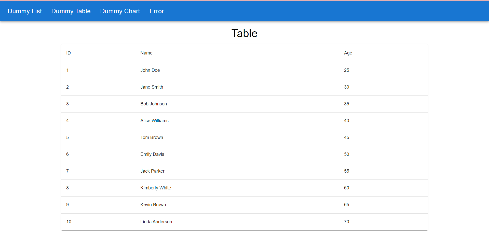

## Installation 👷

1. Clone this repository:

```
git clone https://github.com/dmytrotsymbal/react-cms.git
```

2. Install dependencies:

```
npm install
```

## Preview



## Live 🌐

[https://fascinating-faloodeh-9d575a.netlify.app/tabs/DummyList](https://fascinating-faloodeh-9d575a.netlify.app/tabs/DummyList)
